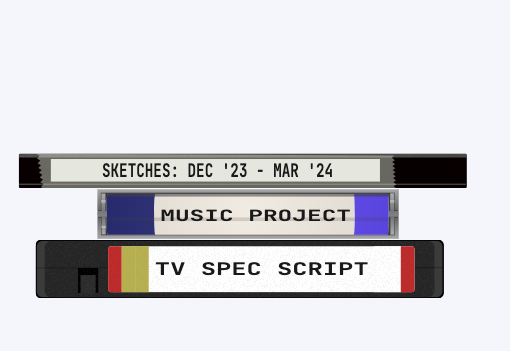

## Run demo site locally

bundle install
bundle exec jekyll serve --livereload

# jekyll_project_stack_portfolio

This theme is a little retro flavored and is designed to be a portfolio for projects, rather than a blog. It displays a stack of projects on the sidebar as a visual stack of VHS tapes, notebooks or (double) CD cases.



# Features

* Dark mode toggle
* Mobile friendly
* SEO friendly
* Sooo customizable you can spend so much time procrastinating

# Configure/Customize

A project's stack style is set in the front matter of the project page.
``` yaml
---
layout: project
type: vhs               #<---- makes this as a VHS tape in the stack
stack_style: drawing    #<---- style class preset
title: "Sketches".      #<---- Text on the spine of the tape (and page title)
show_title: true.       #<---- show the title on the page (or not)
draft: false            #<---- if true, this project will not be displayed in the stack
---
```

The stack_style class presets are defined in `_sass/_stack-presets.scss` and can be customized there.

e.g.
``` css
.tape1 {
  --tab_unlocked: 1; // 0 or 1 to set whether the VHS lock tab is removed
  --color1: #be2c2c;
  --color2: #b8b04f;
  --color3: #b8b04f;
  --color6: #be2c2c;
}
```
Available styles are comment-documented in that file, but basically you can customize colors for stack items using set css variables. e.g the tape has 6 color zones that allow a lot of visual variety.
